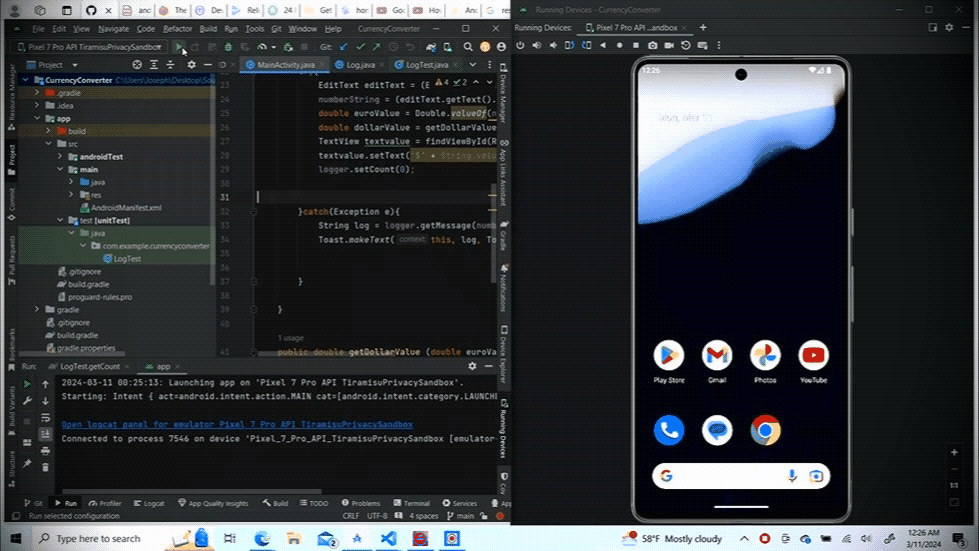
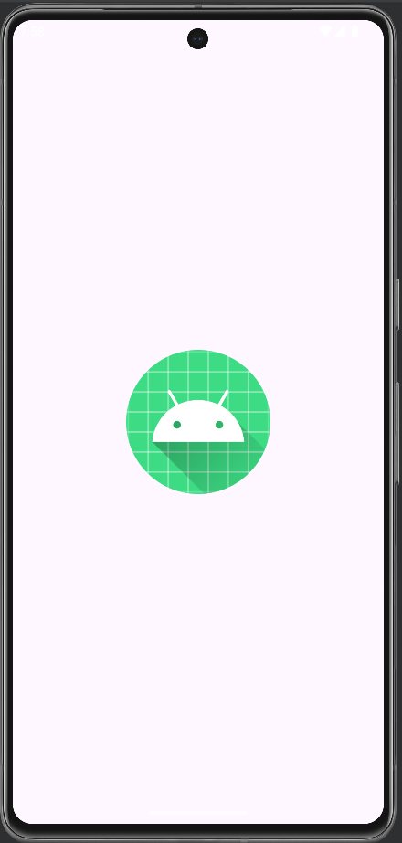
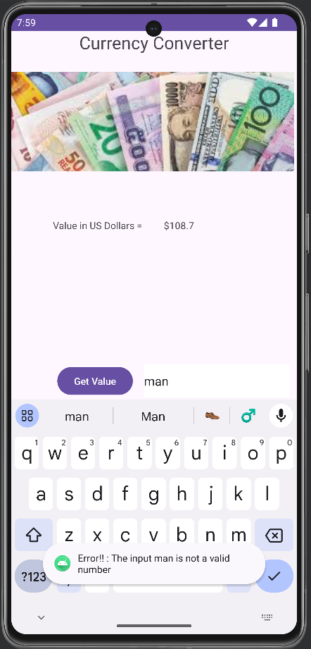
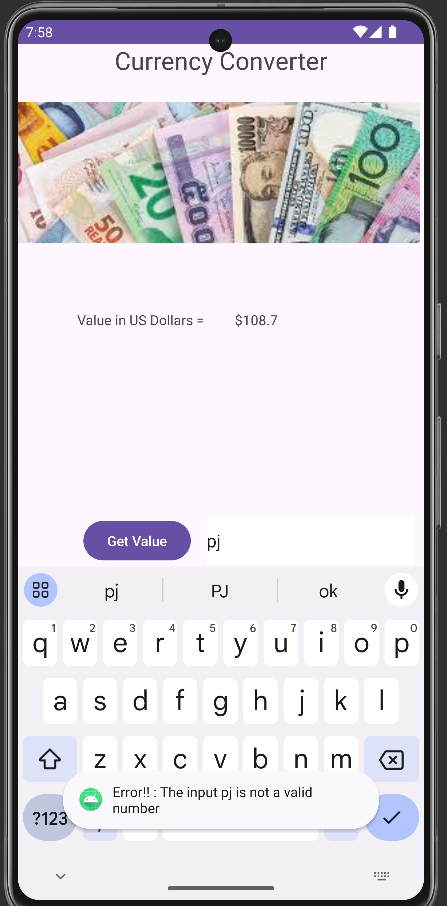
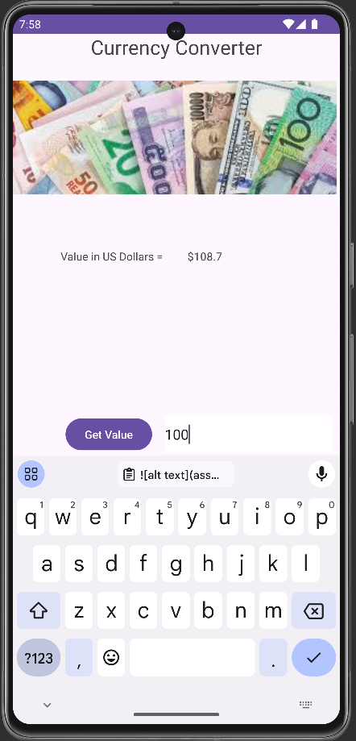
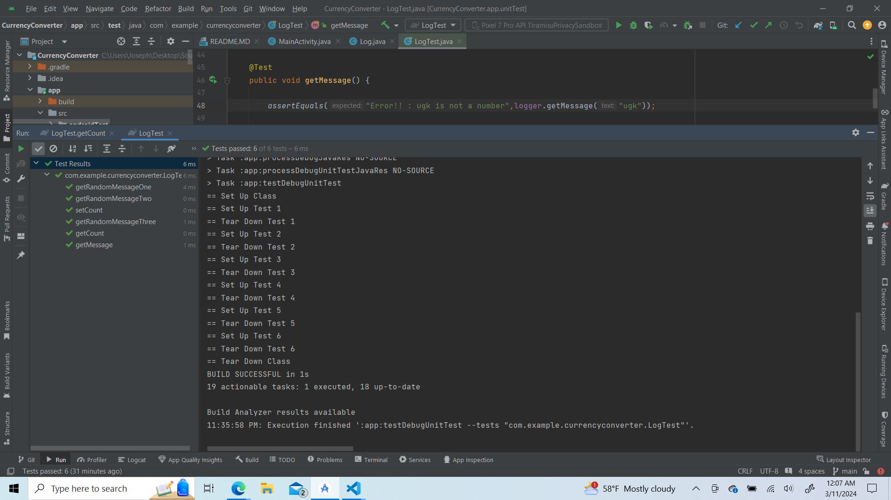

# Currency Converter using Java

## Description
This mobile app takes in user inputs ,converts EU currency to US dollars


## Authors

- [@jadogeri](https://www.github.com/jadogeri)


## Demo




## Table of Contents

- [Screenshots](#screenshots)
- [Installation](#installation)
    - [Download Java for Windows](#download-java-for-windows)
    - [Install Java on Windows 10](#install-java-on-windows-10)
    - [Set Environmental Variables in Java](#set-environmental-variables-in-java)
        - [Step 1: Add Java to System Variables](#step-1-add-java-to-system-variables)
        - [Step 2: Add JAVA_HOME Variable](#step-2-add-java_home-variable)
    - [Install Android Studio](#install-android-studio)
- [Tech Stack](#tech-stack)
- [Usage](#usage)
    -[Run Locally](#run-locally)
- [Tests](#tests)
- [About me](#about-me)
- [License](#license)
- [Credits](#credits)


## Screenshots

|    |   |                 
|  | 
 | 

## Installation

Check if java JDK has been installed 

1. Type cmd in the windows search bar 

2. Type command cmd in the windows search bar

3. Press enter to open Terminal / Command Prompt.

4. Type command below  
```bash
  javac --version
```


if no similar output displaying jdk version , proceed to download Java JDK

### Download Java for Windows 

To download the latest Java Development Kit installation file for Windows 10:

1. Open a web browser and navigate to the [Oracle](https://www.oracle.com/java/technologies/downloads/#jdk21-windows) Java Downloads page.

2. Select the latest JDK version. In this example, the latest available version is JDK 21.

3. Access the Windows tab.

4. Click the Installer download link.

### Install Java on Windows 10
To install Java on your Windows system:

1. Double-click the downloaded Java file to start the installation.

2. Once the installation wizard welcome screen appears, select Next to proceed.

3. Choose the destination folder for the Java installation files, or stick to the default path and click Next.

4. The installation process is complete when the Successfully Installed message appears. Click Close to exit the wizard.

## Set Environmental Variables in Java
Follow the steps in the sections below to configure Java environment variables in Windows.

### Step 1: Add Java to System Variables
This step ensures that Java is accessible from the command line in any directory.

1. Open the Start menu and search for environment variables.

2. Select Edit the system environment variables.

3. Select Advanced in the System Properties window.

4. Click Environment Variables.

5. Select the Path variable in the System variables category and click Edit.

6. Click New.

7. Enter the path to the Java bin directory.

8. Click OK to save the changes and exit the variable editing window.

### Step 2: Add JAVA_HOME Variable
Some applications require the JAVA_HOME variable to point to the JDK installation directory. Follow the steps below to create the variable:

1. Click New under the System variables category to create a new variable.

2. Name the variable JAVA_HOME.

3. Enter the path to your Java JDK directory in the variable value field.

4. Click OK.

## Install Android Studio

1. Download the latest version of Android Studio using this [link](https://developer.android.com/studio).

If you downloaded an .exe file (recommended), double-click to launch it.

If you downloaded a .zip file:
- Unpack the .zip.
- Copy the android-studio folder into your Program Files folder.
- Open the android-studio > bin folder.
- Launch studio64.exe (for 64-bit machines) or studio.exe (for 32-bit machines).
- Follow the Setup Wizard in Android Studio and install any recommended SDK packages.


## Tech Stack

**Client:** Junit, Java

## Usage

### Run Locally

#### Get Project 

1. Download from Github
2. Clone the project 

1. Download from Github
. Navigate to project using link [Currency Converter Link](https://github.com/jadogeri/Android)
. Click on the code button.
. Choose the option Download Zip .
. Navigate to location where the zipped file was saved.
. Place cursor on file, right click using mouse then choose extract file.

Go to the project directory

```bash
   cd Android/Beginner/CurrencyConverter
```

2. Clone the project 

```bash
  git clone https://github.com/jadogeri/Android.git
```

Go to the project directory

```bash
  cd Android/Beginner/CurrencyConverter
```

Start project

1. Open Android Studio.
2. On the top tab bar, select File --> Open.
3. Navigate to location project was saved i.e Android/Beginner/CurrencyConverter.
4. Select project and press ok.
5. On the top tab bar, Press Run --> Run.


## Tests

1. Change to project view structure
2. navigate to app/src/test unitTest/java/com.example.currencyconverter
3. right click on LogTest.java and select , 

```bash
  run LogTest.java
```


## About Me  
🚀
I'm a Database Programmer learning Mobile Development using Java...


## License

[LICENSE](/LICENSE)

## Credits

 - [Awesome Readme Templates](https://awesomeopensource.com/project/elangosundar/awesome-README-templates)
 - [Awesome README](https://github.com/matiassingers/awesome-readme)
 - [How to write a Good readme](https://bulldogjob.com/news/449-how-to-write-a-good-readme-for-your-github-project)

 - [How to write Junit Test](https://www.youtube.com/watch?v=rsl7VpB2tSw)
 - [How to install android on windows](https://developer.android.com/studio/install)
 - [How to install Java JDK on windows](https://phoenixnap.com/kb/install-java-windows)